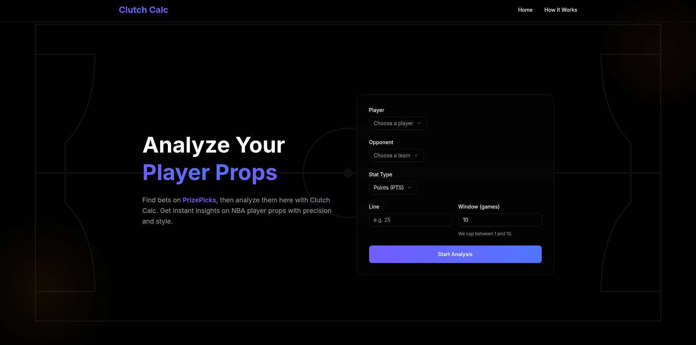

# 🏀 ClutchCalc

**ClutchCalc** helps sports bettors and NBA fans analyze player prop bets using real historical data.  
You enter a player, their opponent, and a line (e.g., *LeBron James – 25 points vs Celtics*), and ClutchCalc instantly calculates the hit rate and visualizes performance across recent matchups.

---

## 🎥 Demo Video 
[](https://youtu.be/qhHo9QpL_3c)


---

## 🚀 Features

- 🧮 **Player Prop Analyzer** — Compare player stats (PTS, REB, AST) vs recent matchups.  
- 📊 **Dynamic Graphs** — Recharts-powered bar graph showing recent game trends.  
- 🔍 **Smart Filtering** — Automatically pulls official NBA data (no API key needed).  
- 💡 **Quick Insights** — Shows hit percentage, averages, and total sample size.  
- ⚡ **Fast & Responsive UI** — Built with Next.js 14 + Tailwind CSS for performance and simplicity.

---

## 🧠 How It Works

1. Choose a **player**, **opponent**, and **stat** (points, rebounds, assists).  
2. Enter the **prop line** you’re analyzing (e.g. 25 for points).  
3. ClutchCalc fetches recent matchup data via the [nba_api](https://github.com/swar/nba_api) library.  
4. The system analyzes performance, calculates hit rate, and visualizes the trend in a clean bar chart.

---

## 🛠️ Tech Stack

| Area | Technology |
|------|-------------|
| Frontend | Next.js 14 (App Router), React, TypeScript |
| Styling | Tailwind CSS, shadcn/ui, Framer Motion |
| Charts | Recharts |
| Backend | Next.js API Routes (Node) |
| Data Source | [`nba_api`](https://github.com/swar/nba_api) — official NBA.com API client |
| Hosting | Vercel |

---

## ⚙️ Local Development Setup

### 1️⃣ Clone the repository
```bash
git clone https://github.com/MahdiAlsalami/clutchcalc.git
cd clutchcalc
